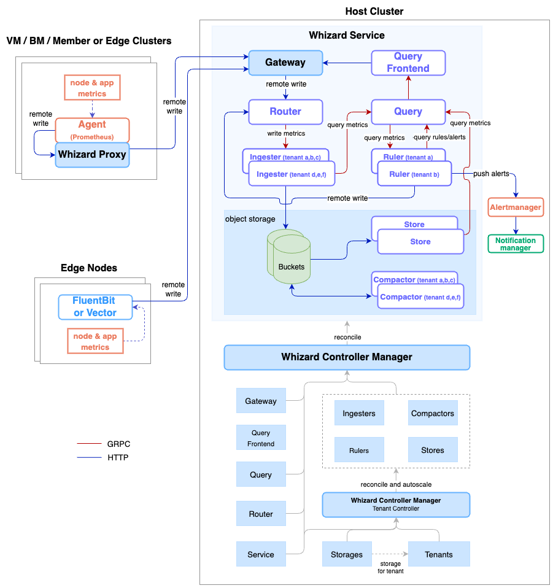

# Whizard 架构

## 架构

- 全部组件通过 CRD 定义
- 引入租户体系，便于租户隔离；并可通过 Gateway/Agent Proxy 机制保证租户写入数据安全与隔离
- 引入各组件的动态伸缩机制：Ingester, Store, Ruler, Compactor
- 引入分片机制：全局的 Ruler 可根据规则组进行分片，均衡负载
- 引入基于租户的数据生命周期管理机制，租户删除后将删除磁盘及对象存储上的遗留数据。
- 查询优化：近期数据查询磁盘（36h），长期数据可查对象存储
- 没有对象存储也可以仅利用本地磁盘存储数据

## Whizard CRDs

- Service：定义一个 Whizard 服务及该服务所需的租户元信息、对应的长期存储及组件配置等
- Tenant：定义一个使用 Whzard 服务的租户，包括租户 ID 及分配给该租户的 Ruler, Ingester, Compactor；集成到 KubeSphere 租户对应于集群
- Gateway：接收各租户 (whizard-agent-proxy) remote write 写入数据的网关，可定义用于安全通信的证书
- Storage：定义 Prometheus 长期存储需要的对象存储及租户长期数据管理相关信息（Block 生命周期管理）
- Query & QueryFrontEnd：用户查询所有 metrics 的统一接口
- Router：根据租户标签分发写入的 Metrics 数据到相应 Ingester
- Ingester：接收一个或多个租户的写入数据，每个租户一个 tsdb（没有数据抓取能力的 Prometheus）；可上传落盘 block 到对象存储 Whizard 新增根据租户数量自动伸缩 Ingester 实例的功能（默认每个 Ingester 处理 3 个租户的数据）；以及已删除租户的本地磁盘数据清理的功能
- Ruler：根据 remote write 过来的原始数据计算 recording rule 生成 metrics，计算 Alert rule 发出告警, Whizard 新增为每个租户分配独立的 Ruler 的功能；以及全局 Ruler 可将 RuleGroup 在多个副本间进行分配以均衡 Rule 计算工作负载的问题
- Compactor：用于存放在对象存储的 block 的压缩和降采样。Whizard 新增根据租户数量自动伸缩 Compactor 实例的功能（默认每个 Compactor 处理 10 个租户的数据）；以及已删除租户的对象存储数据清理的功能
- Store：Query & QueryFrontEnd， Ruler 等组件查询对象存储上长期数据的接口 
