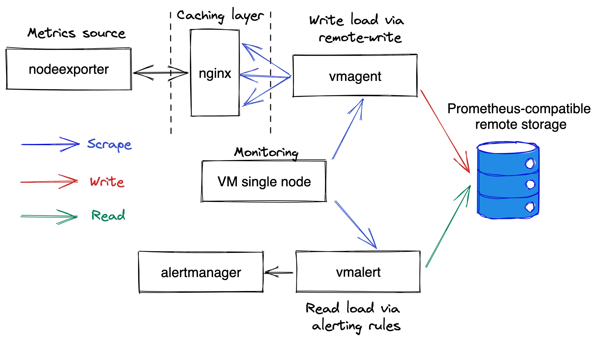

# Whizard 性能测试说明

对于 Whizard 的性能测试，通常可以从以下几个方面入手：

1. 数据接收性能：测试 Whizard 在数据接受方面的性能表现，包括数据摄入速度、数据处理时间、数据存储性能等方面。
2. 数据查询性能：测试 Whizard 在查询和分析数据方面的性能表现，包括查询响应时间、查询吞吐量、查询结果的准确性等方面。
3. 可扩展性测试：测试 Whizard 在处理多租户数据时的性能表现，包括水平扩展性和租户管理等方面。

## 性能测试工具

[Prometheus-benchmark](https://github.com/frezes/prometheus-benchmark/tree/dev) allows testing data ingestion and querying performance for Prometheus-compatible systems on production-like workload.

The prometheus-benchmark scrapes metrics from [node_exporter](https://github.com/prometheus/node_exporter)
and pushes the scraped metrics to the configured Prometheus-compatible remote storage systems.
These systems must support [Prometheus remote_write API](https://prometheus.io/docs/prometheus/latest/configuration/configuration/#remote_write)
for measuring data ingestion performance. Optionally these systems may support
[Prometheus querying API](https://prometheus.io/docs/prometheus/latest/querying/api/#instant-queries) for measuring query performance.

The helm chart deploys the following pods:

- `vmagent` with the following containers:
  - [nodeexporter](https://github.com/prometheus/node_exporter) - collects real metrics from Kubernetes node where it runs.
  - [nginx](https://nginx.org/) - caches responses from `nodeexporter` for 1 second in order to reduce load on it
    when scraping big number of targets.
  - [vmagent-config-updater](services/vmagent-config-updater/README.md) - generates config for target scraping.
    It is also responsible for generating time series churn rate via periodic updating of the generated targets.
  - [vmagent](https://docs.victoriametrics.com/vmagent.html) - scrapes `nodeexporter` metrics via `nginx`
    for targets generated by `vmagent-config-updater`.
- `vmalert` with the following containers:
  - [vmalert](https://docs.victoriametrics.com/vmalert.html) - periodically executes [these alerting rules](chart/files/alerts.yaml)
    (aka read queries) against the testes remote storage.
  - [alertmanager](https://github.com/prometheus/alertmanager) - receives notifications from `vmalert`.
    It is configured as a blackhole for the received notifications.
  `vmalert` pod is optional - it is used for generating read query load.
- `vmsingle` - this pod runs a [single-node VictoriaMetrics](https://docs.victoriametrics.com/), which collects metrics from `vmagent` and `vmalert` pods,
  so they could be analyzed during benchmark execution.

### 性能测试关键指标描述

- Data ingestion rate
- 99th percentile for the duration to execute queries
- 99th percentile for the duration to push the collected data to the configured remote storage systems

### 性能测试报告

**当前版本**：

-

**历史版本:**

- [Whizard v0.6.0 数据读写性能测试报告](benchmark-v0.6.0.md)
- [Whizard v0.5.0 数据读写性能测试报告](benchmark-v0.5.0.md)
