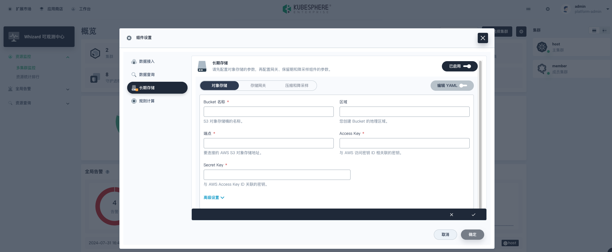

# Whizard 存储

## 1. 本地存储模式

Whizard 可以通过`PV/PVC` 挂载数据卷的方式， 使用本地存储，可实现大数据量的数据存储。配置上可以在 `services.monitoring.whizard.io` CRD 中修改 `ingesterTemplateSpec.dataVolume` 进行更新。

```yaml
  ingesterTemplateSpec:
    dataVolume:
      persistentVolumeClaim:
        spec:
          resources:
            requests:
              storage: 20Gi
```

## 2. 本地存储 + 对象存储模式

Whizard 推荐使用本地存储 + 对象存储模式存储海量数据，本地存储近期数据，历史数据存储在对象存储上，通过数据压缩与降采样，进一步节省存储空间，提升数据查询能力。

### 2.1 创建对象存储的自定义资源

首先，为Storage CR的创建Secret，借助 Kubernetes Secret 加密对象存储访问密钥`access_key`与`secret_key`。

```shell
kubectl create secret generic -n kubesphere-monitoring-system storage-remote-secret --from-literal=accessKey=<your_access_key> --from-literal=secretKey=<your_secret_key>
```

然后，我们创建 Storage CR，更多 `storages.monitoring.whizard.io` 字段配置可参考其[定义](../References/api/api.md)。

```shell
cat <<EOF | kubectl apply -f -
apiVersion: monitoring.whizard.io/v1alpha1
kind: Storage
metadata:
  name: remote
  namespace: kubesphere-monitoring-system
spec:
  S3:
    bucket: "xxxxxxxxxx"
    endpoint: "s3.pek3b.qingstor.com:443"
    accessKey: 
      name: storage-secret
      key: accessKey
    secretKey: 
      name: storage-secret
      key: secretKey
EOF
```

创建好 **Storage CR** 后，我们可以为 `services.monitoring.whizard.io` 配置默认的对象存储 ,也可以为特定租户配置独立的对象存储。

### 2.2 为 Service 配置默认的对象存储

在创建好 Storage CR 后，我们可以为 `services.monitoring.whizard.io` 配置默认的对象存储，将 Storage CR 与 Service CR  进行关联。我们以 `kubesphere-monitoring-system` namespace 下的 `whizard` Service CR 为例，关联刚刚创建的 reomte Storage CR。

```sh
kubectl edit service.monitoring.whizard.io  -n kubesphere-monitoring-system whizard
```

```yaml
spec:
  storage:                                      #更新service.spec 中的storage字段，关联使用的对象存储
    name: remote                     
    namespace: kubesphere-monitoring-system
```

除了直接操作 CR 方式外，你也可以通过 KuberSphere Enterprise 的控制台进行操作, 路径为: 进入 Whizard 可观测中心 -> 组件设置 -> 长期存储


